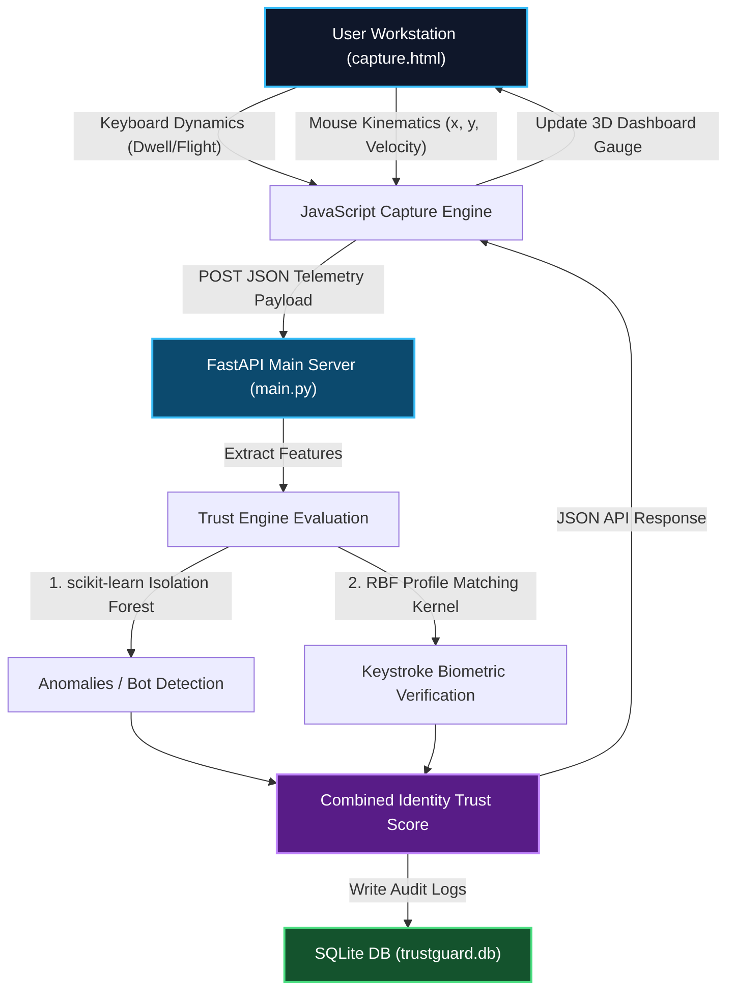

# 🛡️ TrustGuard AI: Zero-Trust Continuous Biometrics Console

[](https://www.python.org/)
[](https://opensource.org/licenses/MIT)
[](https://fastapi.tiangolo.com/)
[](https://scikit-learn.org/)

TrustGuard AI is a continuous biometric identity authentication console. Instead of authenticating a user just once at login (e.g., via password or MFA), TrustGuard AI continuously verifies that the person sitting at the keyboard is the legitimate user by analyzing their typing dynamics and mouse movement kinematics in real-time.

---

## 📐 Architecture & System Flow

The diagram below outlines how user telemetry travels from the frontend workstation to the FastAPI backend, where a hybrid ML model computes identity scores, flags threats, and logs results:



---

## ✨ Features

- 🕵️ **Continuous Identity Verification**: Evaluates keystroke timing features (Dwell Times, Flight Times) and mouse movement speeds every 5 seconds.
- 📉 **Hybrid Trust Evaluation**: Uses a hybrid scoring engine matching user behavior against baseline profiles using an **Exponential Radial Basis Function (RBF) Kernel** ($30\%$) and a **scikit-learn Isolation Forest Classifier** ($70\%$).
- 🎨 **Glassmorphism 3D Dashboard**: A cyberpunk dark-mode dashboard featuring interactive 3D hover-tilt cards, ambient matrix-style background cyber-rain, and animated SVGs.
- ⚡ **Live Mouse Kinematics Visualizer**: Real-time cursor trace tracking path trails and ripple animations for click coordinates.
- 🤖 **Adversarial Threat Simulator**: Hub to simulate automated script bots (perfect 100ms timings with zero variance) or erratic attackers to verify immediate bot flagging.
- ⚙️ **Sensitivity Policy Control**: Toggle between **Strict** ($75\%$ threshold), **Balanced** ($50\%$ threshold), and **Relaxed** ($30\%$ threshold) policy levels in real-time.
- 🔐 **PIN-Authorized Audit Ledger**: Restricts access to past database session history behind a secure admin PIN auth screen (`1234`).

---

## 📊 Model Performance & Benchmarks

The machine learning classifier was trained on **21,400 datasets** mapping human typing vectors against simulated bot attacks:

| Metric | Score / Benchmark | Description |
| :--- | :---: | :--- |
| **False Rejection Rate (FRR)** | **`2.09%`** | Rate at which genuine humans are incorrectly flagged as suspicious. |
| **False Acceptance Rate (FAR)** | **`0.00%`** | Rate at which automated script bots are incorrectly verified as genuine. |
| **Average Human Score** | **`81.02%`** | Average confidence score generated during human typing. |
| **Average Script Bot Score** | **`0.00%`** | Average score for bots (flagged immediately after 5 keys). |
| **Average Erratic Attacker** | **`37.33%`** | Average score for random timing spoofing attacks. |

---

## 📂 Project Structure

```
TrustGuardAI/
├── backend/
│   ├── main.py            # FastAPI Application & Routes
│   ├── database.py        # SQLite Database connection setup
│   ├── db_models.py       # SQLAlchemy Database Schemas
│   ├── crud.py            # Database CRUD helper queries
│   ├── trust_engine.py    # Hybrid biometric decision maker
│   └── profile_matcher.py # Exponential RBF Similarity kernel
├── ml/
│   ├── train_model.py     # Model training script
│   ├── evaluate_model.py  # Model evaluation and FAR/FRR test suite
│   ├── preprocess.py      # Feature engineering helper
│   ├── model.pkl          # Serialized scikit-learn Isolation Forest model
│   └── scaler.pkl         # Serialized StandardScaler model parameters
├── frontend/
│   ├── capture.html       # Cybersecurity Console UI
│   ├── style.css          # Glassmorphic cyber themes & 3D styling
│   └── script.js          # Telemetry collection & 3D tilts script
└── trustguard.db          # SQLite Database File
```

---

## 🚀 Getting Started

### 1. Prerequisites
- Python 3.8+
- Modern Web Browser (Chrome / Edge / Firefox)

### 2. Setup virtual environment & dependencies
```bash
# Clone the repository
git clone https://github.com/your-username/TrustGuardAI.git
cd TrustGuardAI

# Create virtual environment
python -m venv venv

# Activate virtual environment
# On Windows:
.\venv\Scripts\activate
# On Linux/macOS:
source venv/bin/activate

# Install dependencies
pip install fastapi uvicorn scikit-learn pandas numpy sqlalchemy requests
```

### 3. Run FastAPI Backend
```bash
# Run server using Uvicorn
python -m uvicorn main:app --app-dir backend --host 127.0.0.1 --port 8000
```
> [!NOTE]
> The backend server runs at `http://127.0.0.1:8000`. Keep this process running to process metrics from the frontend.

### 4. Launch Frontend
Simply open the client dashboard file inside your web browser:
`frontend/capture.html`

---

## 🔒 Security Operations Log Table

To review historical session biometric scores, click the **Security Ledger** button at the top right of the dashboard, enter PIN code `1234`, and unlock the query.

> [!WARNING]
> Accessing the ledger hits the `/session/history` route which requires an authorized `X-Admin-PIN` header. Unauthorized queries return a `403 Forbidden` response.

---

## 📄 License

This project is licensed under the MIT License - see the [LICENSE](LICENSE) file for details.
