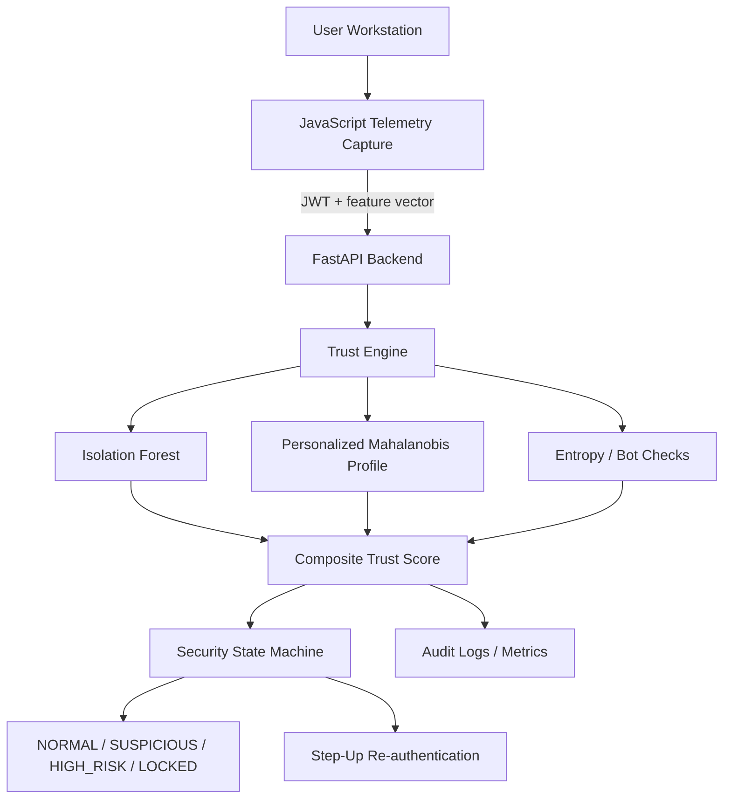

# 🛡️ TrustGuard AI — Zero-Trust Continuous Behavioral Authentication

[](https://www.python.org/)
[](LICENSE)
[](https://fastapi.tiangolo.com/)
[](https://scikit-learn.org/)
[](docs/COVERAGE_REPORT.md)

TrustGuard AI is a continuous behavioral-authentication system that evaluates whether the current user still matches their enrolled behavioral profile during an active session. Instead of relying only on authentication at login, it periodically analyzes **keystroke dynamics** and supporting telemetry, combines anomaly detection with personalized profile similarity, and converts the result into a trust score and security state.

> **Security position:** TrustGuard AI is a research/demo continuous-verification layer. It is not intended to replace conventional authentication or MFA.

---

## 📐 Architecture & System Flow


```mermaid
graph TD
    A[User Workstation] --> B[JavaScript Telemetry Capture]
    B -->|JWT + feature vector| C[FastAPI Backend]
    C --> D[Trust Engine]
    D --> E[Isolation Forest]
    D --> F[Personalized Mahalanobis Profile]
    D --> G[Entropy / Bot Checks]
    E --> H[Composite Trust Score]
    F --> H
    G --> H
    H --> I[Security State Machine]
    I --> J[NORMAL / SUSPICIOUS / HIGH_RISK / LOCKED]
    I --> K[Step-Up Re-authentication]
    H --> L[Audit Logs / Metrics]
```

### Runtime decision flow

- **Isolation Forest (70%)** provides global anomaly evidence.
- **Personalized profile similarity (30%)** measures how closely the current behavior matches the user's historical baseline.
- **Entropy and micro-variance checks** detect highly repetitive automated timing patterns.
- A **hysteresis-based state machine** prevents a single noisy observation from immediately escalating or de-escalating the session.

The current profile matcher uses a 7-dimensional behavioral vector: average dwell time, dwell-time variance, average flight time, flight-time variance, typing speed, dwell/flight ratio, and pause count.

---

## ✨ Key Features

- 🕵️ **Continuous Verification** — evaluates behavioral telemetry throughout an active session.
- 🧠 **Hybrid Trust Engine** — combines Isolation Forest anomaly scoring with personalized Mahalanobis profile similarity.
- 🛡️ **Bot Detection** — detects zero-variance and low-entropy timing patterns.
- 📈 **Adaptive Thresholds** — adjusts the security threshold using historical behavioral stability.
- 🚨 **Security State Machine** — `NORMAL → SUSPICIOUS → HIGH_RISK → LOCKED` with hysteresis.
- 🔐 **JWT Session Authentication** — protects telemetry endpoints with session-scoped Bearer tokens.
- 🔑 **Step-Up Re-authentication** — suspicious sessions can require an additional verification step.
- 📋 **Audit Ledger** — records session and security events for investigation.
- 📊 **Prometheus Metrics** — exposes operational metrics for monitoring.
- 🧹 **Profile Poisoning Protection** — trusted observations are required before behavioral baselines are adapted, with drift controls.
- 🐳 **Docker Support** — production-oriented containerization with a non-root runtime user.
- 🧪 **Automated Testing** — backend and frontend tests with coverage reporting.

---

## 🧪 Model Evaluation Status

TrustGuard includes a session-disjoint, cross-subject evaluation pipeline for comparing Isolation Forest, Mahalanobis distance, One-Class SVM, and hybrid candidates on the CMU keystroke dataset.

**Important:** performance numbers from earlier model versions are intentionally **not presented as current production metrics**. The repository previously contained conflicting model metadata and evaluation results. The current production metadata therefore marks biometric performance as `PENDING_FRESH_EVALUATION` until the exact runtime pipeline is evaluated end-to-end.

Run the evaluation pipeline after installing the dependencies:

```bash
python ml/evaluate_model.py
```

Only metrics generated from the current production inference path should be reported in the final resume/README benchmark table.

See [`docs/ML_EVALUATION.md`](docs/ML_EVALUATION.md) for the evaluation methodology.

---

## 📂 Project Structure

```text
TrustGuardAI/
├── .github/workflows/       # CI/CD and security checks
├── backend/
│   ├── main.py              # FastAPI routes and application lifecycle
│   ├── config.py            # Environment/configuration management
│   ├── auth.py              # JWT authentication
│   ├── metrics.py           # Prometheus metrics
│   ├── database.py          # Database configuration
│   ├── db_models.py         # SQLAlchemy models
│   ├── crud.py              # Database operations
│   ├── session_manager.py   # Session storage
│   ├── trust_engine.py      # Trust scoring and security states
│   └── profile_matcher.py   # Personalized Mahalanobis comparison
├── ml/
│   ├── train_model.py       # Production-compatible model training
│   ├── evaluate_model.py    # Biometric evaluation pipeline
│   ├── preprocess.py        # 7D feature engineering
│   ├── predictor.py         # Production ML inference
│   ├── model.pkl            # Serialized Isolation Forest
│   ├── scaler.pkl           # Matching StandardScaler
│   └── artifacts/           # Model registry metadata
├── frontend/
│   ├── capture.html         # Security dashboard
│   ├── style.css            # Dashboard styling
│   └── script.js            # Telemetry collection and UI logic
├── tests/                   # Automated tests
├── docs/                    # Evaluation and coverage documentation
├── Dockerfile
├── docker-compose.yml
├── requirements.txt
└── README.md
```

> Local SQLite databases are runtime artifacts and should not contain real user biometric data in a public repository.

---

## 🚀 Getting Started

### 1. Clone and install

```bash
git clone https://github.com/sandeepannamalai2007-creator/TrustGuardAI.git
cd TrustGuardAI

python -m venv venv

# Windows
.\venv\Scripts\activate

# Linux/macOS
source venv/bin/activate

pip install -r requirements.txt
```

### 2. Run the backend

```bash
python -m uvicorn main:app --app-dir backend --host 127.0.0.1 --port 8000
```

### 3. Run the frontend

Serve `frontend/` with a local static server such as VS Code Live Server and open `capture.html`.

### 4. Run tests

```bash
python -m pytest --verbose
```

### 5. Docker

For the containerized deployment path:

```bash
docker compose up --build
```

Configure production secrets through environment variables. Never commit real credentials to the repository.

---

## 🔒 Security & Privacy

TrustGuard processes behavioral telemetry such as keystroke timing and mouse-related signals. A production deployment should apply data minimization, retention limits, access controls, encryption, and appropriate user consent.

Production secrets must be supplied through environment variables or a secret manager. Development PINs or JWT defaults must never be treated as production credentials.

See [`SECURITY.md`](SECURITY.md) for vulnerability reporting guidance.

---

## ⚠️ Limitations

- Behavioral patterns can change because of fatigue, stress, hardware, environment, or user context.
- Behavioral authentication can produce false positives and false negatives.
- The current evaluation pipeline must be rerun whenever the production feature/model pipeline changes.
- The system is a continuous-verification layer, not a replacement for primary authentication or MFA.

---

## 📄 License

This project is licensed under the MIT License. See [`LICENSE`](LICENSE).
